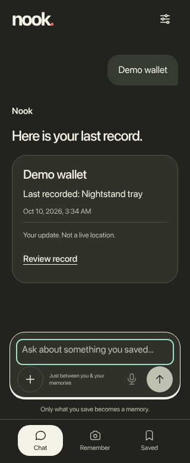
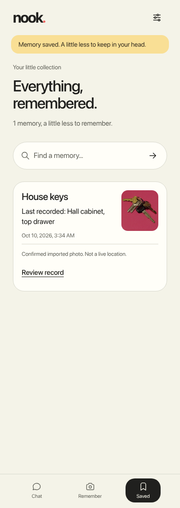

# Nook

Your everyday memory buddy. Save a reviewed memory and find its last-recorded place, time and photo.

[Quick start](#quick-start) · [Screenshots](#screenshots) · [Why local AI?](#why-does-this-product-benefit-from-running-ai-locally) · [Tests](#run-the-checks) · [Disclosures](#the-disclosures)

## The project

- **Remember:** save item names, places and photos after explicit review.
- **Find:** ask typed questions, search aliases and see dated evidence.
- **Maintain:** correct records, review history, mark locations unknown or delete memories.
- **Keep it local:** retain confirmed memories across restarts in a responsive light/dark interface.
- **Add voice:** optional local dictation and spoken replies with separately provisioned speech models.

### Quick start

**Prerequisites:** Linux x86_64, Python **3.11** with `pip` and `venv`, Git, and a modern browser. These commands use Bash/zsh syntax. Tested on Manjaro Linux with CPython 3.11.15; other operating systems are not validated. Internet is needed for the initial clone/install unless files are already cached. Typed mode needs **no model, account or API key**.

**1. Get the source**

```sh
git clone https://github.com/marina21-cs/nook.git
cd nook
```

**2. Install the pinned dependencies**

```sh
python3.11 -m venv .venv
.venv/bin/python -m pip install --require-hashes -r requirements.lock
.venv/bin/python -m pip check
```

**3. Start Nook with a separate demo store**

```sh
APP_DATA_DIR="$PWD/.demo-data" \
APP_PORT=8765 \
APP_VISION_DISABLED=1 \
APP_VOICE_ENABLED=0 \
APP_TEXT_MODEL='' \
.venv/bin/python -m app
```

Open **[http://127.0.0.1:8765/](http://127.0.0.1:8765/)** on the same computer. Nook creates the demo store on first launch and reuses it on restart. **Stop:** press `Ctrl+C` in the server terminal. Keep `.demo-data` private.

**4. Try an invented memory**

1. Select **Get Started → Remember → Or save without a photo**.
2. Enter **House keys** and **Hall cabinet, top drawer**.
3. Select **Review memory**, check **I checked the item and its place**, then **Save memory**.
4. Open **Chat**, type **Where are my house keys?**, and select **Send question**.
5. Use **Saved → Review record** to inspect, correct or delete the memory.

[More synthetic examples](examples/synthetic-memories.json) are supplied for manual entry; there is no seed/import command for this JSON. To try a photo, choose the included public fixture [`tests/fixtures/vision/keys.jpg`](tests/fixtures/vision/keys.jpg) and review its label/place yourself.

<details>
<summary><strong>Optional models and browser-test tooling</strong></summary>

The quick start disables all model inference. Optional voice needs `voice/runtime/bin/python`, compatible speech dependencies and every artifact in the [pinned model manifest](voice/artifacts/manifest.json). The baseline's clean-machine voice installer and full UI speech flow remain unverified; do not treat its historical provisioning scripts as a turnkey installer. [Reproduction details](V1_REPRODUCE.md) record the requirements and laptop-specific resource guards. Models are never downloaded automatically.

Browser integration tests need separately installed Node, Playwright and Chromium. Set `PLAYWRIGHT_MODULE` to the absolute path of the installed Playwright module, `CHROMIUM_EXECUTABLE` to the Chromium executable and `APP_TEST_PYTHON` to the checkout's `.venv/bin/python` before running `node scripts/nook_browser_test.cjs`. The script creates temporary synthetic records; it does not install those tools. Run it in a disposable checkout because it refreshes test evidence/screenshots.

</details>

### Why does this product benefit from running AI locally?

Household details and spoken questions can be personal. With the optional runtime provisioned, **Whisper** can transcribe speech and **Kokoro** can speak a reply on the laptop without sending that audio to a cloud AI provider. This enables offline speech processing after setup and avoids dependence on a per-request cloud AI service, subject to the testing limits below.

Confirmed memories and photos also stay local, but that benefit comes from **SQLite and application logic**, separate from AI. Typed recall is structured evidence lookup, not a general conversational model.

| Works locally after setup | Needs internet |
| --- | --- |
| Browser UI, loopback API, confirmed memories, photos and typed recall | Initial source/dependency/model acquisition |
| Optional speech with matching runtime and model files | GitHub and video/social hosting |

The baseline contains an offline POI-import/cache API, but no area downloader, GPS or routing. A future explicit area refresh would need internet; cached-place lookup is ordinary local data access.

## The proof

### Screenshots

<p align="center">
<a href="deliverables/nook-integration/recall-mobile-dark.png"></a>
</p>

**Dated recall, with its source and limits visible.** Click any image for full size.

<details>
<summary><strong>Review a memory before saving — desktop</strong></summary>

<a href="deliverables/nook-integration/capture-desktop.png"></a>

</details>

<details>
<summary><strong>Saved memories — mobile</strong></summary>

<a href="deliverables/nook-integration/saved-mobile.png"></a>

</details>

[All six screenshots](deliverables/nook-integration/README.md) · [Hashes and provenance](docs/SCREENSHOT_PROVENANCE.json). Captures use invented records and a credited public CC0 photo.

| Submission material | Link or status |
| --- | --- |
| Public repository | [marina21-cs/nook](https://github.com/marina21-cs/nook) |
| Approximately one-minute demo | Pending |
| X/LinkedIn video | Pending |
| Registered team and members | Pending verification |

### Testing and setup limits

**Baseline evidence:** 335 backend tests, 54 browser checks and 335 extracted-source tests passed. [Browser results](deliverables/nook-integration/browser-results.json) · [Archive verification](docs/BASELINE_VERIFICATION.json). Fifteen real-vision cases were excluded; speech/device boundaries were mocked in the browser suite.

**Tested hardware:** AMD Ryzen 5 7535HS, 6 cores/12 threads, approximately 14.8 GiB usable RAM, Manjaro Linux x86_64 and CPython 3.11.15. Application/script/test bytes match [baseline source commit `fca8ae7`](https://github.com/marina21-cs/nook/tree/fca8ae7d5ca22560550d000c9f01468d2b982052); [version provenance](docs/PUBLICATION_PROVENANCE.md) records the original ZIP. These README updates did not rerun heavy tests or models, install dependencies, or establish a fresh-machine pass.

Optional speech has earlier synthetic backend evidence; full UI speech, human English/Taglish quality and clean-machine voice setup remain unverified. Laptop-specific resource guards can block model execution. General visual recognition, physical media-device behavior and native 4GB-phone performance are also unverified. Saved evidence does not prove an item's current location. Later actions, profile/setup changes and area downloads are outside this baseline and await separate acceptance.

### Run the checks

From the repository root, after installing the locked dependencies:

```sh
.venv/bin/python -m pytest --ignore=tests/test_vision.py
.venv/bin/ruff check app tests scripts
.venv/bin/mypy app
```

With Node installed:

```sh
node scripts/frontend_audio_test.cjs
```

The optional browser command is `node scripts/nook_browser_test.cjs`; provision its explicit tooling paths as described above. Software checks do not establish real model or device acceptance.

## The disclosures

**Runtime components**

| Component | Purpose | Configuration in this release |
| --- | --- | --- |
| Structured evidence lookup | Retrieve confirmed records, aliases, dates and photos from SQLite | Default typed flow; deterministic application logic, not a language model |
| [Whisper tiny](https://huggingface.co/openai/whisper-tiny/tree/169d4a4341b33bc18d8881c4b69c2e104e1cc0af) | Local speech-to-text | Optional; off in the setup command |
| [Kokoro-82M / af_heart](https://huggingface.co/hexgrad/Kokoro-82M/tree/f3ff3571791e39611d31c381e3a41a3af07b4987) | Local text-to-speech | Optional; off in the setup command |
| [OpenCV Zoo NanoDet](https://huggingface.co/opencv/object_detection_nanodet/blob/81a2a35b00f92e9bd03f03d9b611076d9aa2f942/README.md) | Object-box/category suggestions when enabled with matching weights | Disabled in the setup command; poor target-item results, so user review remains essential |

Speech file URLs, pinned revisions, sizes and SHA256 hashes are in the [artifact manifest](voice/artifacts/manifest.json); NanoDet's hash and terms are in [model provenance](models/README.md). No weights are published. Retained [voice/model notices](voice/licenses/), [Whisper model card](voice/artifacts/whisper/README.md), [NanoDet license](models/LICENSE) and [dependency provenance](V1_PROVENANCE.md) preserve their separate terms, including GPL/LGPL speech components.

**Experiments, not the core engine:** SmolVLM-500M was benchmark-only and was not integrated; its CPU FP32 test timed out after 30 seconds at about 3.9 GiB peak worker RSS. Pre-existing Qwen2.5 0.5B and Gemma 3 1B were evaluated for bounded search normalization, remain disabled by default and did not establish a retrieval improvement. None is an accepted general conversational engine. [Experiment identities, results and license disclosures](docs/MODEL_EXPERIMENTS.md).

**Frameworks and technologies:** Python, FastAPI, Pydantic, Uvicorn, SQLite, HTML/CSS/JavaScript, Pillow, HTTPX, OpenCV and NumPy. Optional speech uses CPU PyTorch, Transformers, Kokoro, Misaki and spaCy. Tests use pytest, Ruff, mypy and Playwright/Chromium. Exact versions and retained hashes: [base lock](requirements.lock), [speech inventory](voice/evidence/dependencies.json), [speech provenance](release/v1/voice-dependency-provenance.json).

**APIs and cloud services:** local FastAPI; official package/model sources for provisioning; GitHub for code hosting. ElevenLabs is planned for video postproduction narration, separate from Nook's local speech. No completed ElevenLabs generation, cloud runtime inference or deployment is claimed here.

**Existing code and assets:** the NanoDet adapter uses Apache-2.0 OpenCV Zoo reference logic. Tabler icons retain their [MIT notice](docs/mobile-ui-reference/TABLER-LICENSE). The keys photo is Eviatar Bach / InverseHypercube's “Keys with pink background.JPG”, CC0 1.0; see [fixture attribution](tests/fixtures/vision/README.md). The included WAV is synthetic Kokoro speech. The UI uses system fonts and inline vectors; final rights/history confirmation for the Rello-inspired mascot and reference-based visual treatment remains pending. Reference captures are excluded. Existing Python/Ollama runtimes and installed text models predate this implementation.

**AI development tools:** Codex assisted code, tests, design, documentation and publication preparation. Complete contributor, pre-hackathon code and additional AI-tool history still needs team confirmation; exact development-model versions and actual Devin use are not inferred from filenames or sponsor tags.

**Application license:** pending the owner's decision; no blanket code license has been selected. Third-party notices remain applicable. Team details, final media/social URLs and disclosure completeness remain open submission fields.
