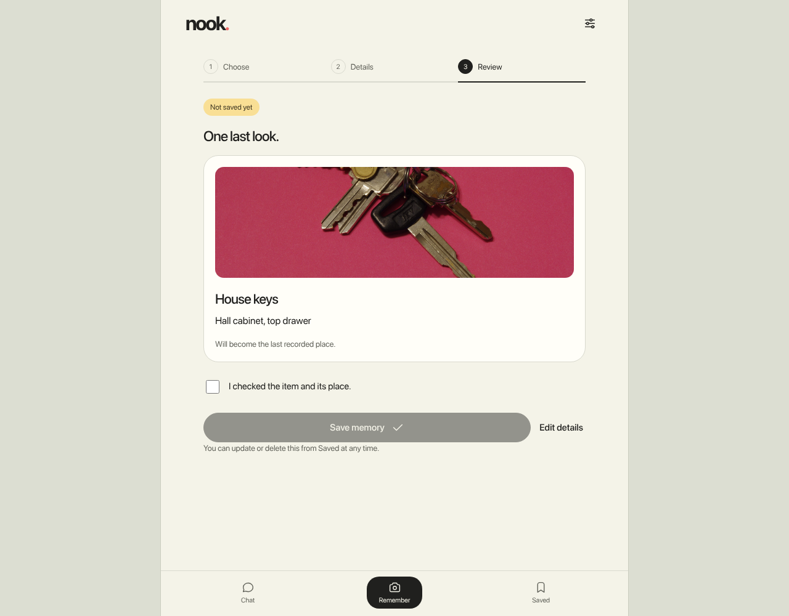
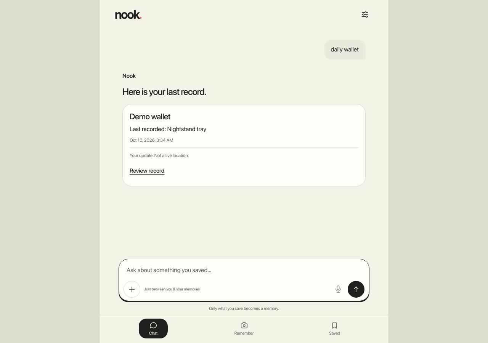

# Nook

## The project

Nook is a household-memory assistant that recalls where you last recorded an item. Review an item and place, explicitly confirm the memory, then ask for dated evidence. Missing or ambiguous records stay explicit; an old photo never proves an item's current location.

**Repository:** https://github.com/marina21-cs/nook  
**Registered team name and member names:** pending verification; the GitHub account is not a verified team roster.  
**Published version:** verified baseline from `Nook-v1-source-20261009.zip`, SHA256 `6af30497d7cae2a3ea59af7847abcf9f9636cc10fae2b0de96b44eda3d4b6f31`. Application/test code is preserved from that archive. Publication documentation is updated; this repository is not byte-identical to the ZIP. See [version evidence](docs/PUBLICATION_PROVENANCE.md).

A newer private working candidate adds actions, nearby-area downloads/offline lookup and setup changes. Its runtime acceptance remains pending and it is **not this published build**. Its static checks and the baseline's test counts must not be combined into an all-features-pass claim.

**Tested hardware:** AMD Ryzen 5 7535HS (6 cores/12 threads), about 14.8 GiB usable RAM, Manjaro Linux x86_64, kernel 6.12.77-1-MANJARO, CPython 3.11.15. Laptop manufacturer/model is unverified. No native-phone or GPU-inference acceptance is claimed.

**Reproduce typed mode** (Python 3.11; installation needs internet or an existing package cache):

```sh
git clone https://github.com/marina21-cs/nook.git
cd nook
python3.11 -m venv .venv
.venv/bin/python -m pip install --require-hashes -r requirements.lock
APP_DATA_DIR="$PWD/.demo-data" APP_PORT=8765 APP_VISION_DISABLED=1 APP_VOICE_ENABLED=0 APP_TEXT_MODEL='' .venv/bin/python -m app
```

Open http://127.0.0.1:8765/ on the same laptop. Stop with Ctrl+C. Use Get Started → Remember → manual entry or the public fixture → Review memory → check confirmation → Save memory → Chat → Send question. Try the invented records in [sample data](examples/synthetic-memories.json); enter them manually rather than importing a private database. The interface is responsive, but it is not a native phone app.

[Reproduction details](V1_REPRODUCE.md) cover optional speech, tooling and limits. Dependencies are version/hash pinned in [requirements.lock](requirements.lock); speech versions and retained input hashes are in [voice/evidence](voice/evidence/) and [voice provenance](release/v1/voice-dependency-provenance.json). Speech needs a separate compatible runtime and matching artifacts; a fresh-machine voice installation is not proven reproducible. The app never downloads models automatically. Sensor guards are laptop-specific and fail closed on unsupported systems; do not remove them to obtain a pass.

## The proof

**Approximately one-minute demo video:** pending production and verified public URL.  
**X/LinkedIn video URL:** pending; no social post or portal submission is claimed.  
**Screenshots:** six inspected baseline captures in [the screenshot gallery](deliverables/nook-integration/README.md). They use invented test records and the credited CC0 keys fixture. Screenshot hashes and exact baseline association are in [screenshot provenance](docs/SCREENSHOT_PROVENANCE.json). They do not demonstrate the later candidate.





Historical release-owner results for the exact baseline: **335 backend tests, 54 browser checks and 335 extracted-source tests passed**. Fifteen real-vision cases were excluded. Browser speech/device boundaries were mocked; a generated camera stream exercised lifecycle behavior. These are software checks, not human speech, physical camera or real inference acceptance. Publication preparation did not rerun heavy tests or models. [Browser results](deliverables/nook-integration/browser-results.json) and [archive verification](docs/BASELINE_VERIFICATION.json) retain evidence.

Re-run software checks in a suitably provisioned environment:

```sh
.venv/bin/python -m pytest --ignore=tests/test_vision.py
.venv/bin/ruff check app tests scripts
.venv/bin/mypy app
node scripts/frontend_audio_test.cjs
# Requires existing Node, Playwright and Chromium; see V1_REPRODUCE.md:
node scripts/nook_browser_test.cjs
```

No CI, deployment or package installation is configured by this publication. Historical optional scripts require excluded assets; they are not included in an all-green promise.

**What runs locally:** browser UI, Python/FastAPI loopback API, SQLite memories, saved photo evidence and deterministic typed recall. Opt-in Whisper tiny transcription and Kokoro speech run locally with separately provisioned artifacts. Optional NanoDet and text models are disabled in the documented configuration. No runtime cloud inference API is required for typed mode.

**What requires internet:** initial package/model acquisition, GitHub code hosting and later video/social hosting. AI development tools are separate cloud services. The published baseline has no newly integrated area-download feature. Browser network observations saw zero external requests during the scoped suite; this is not OS-wide network isolation.

**Limitations:** full real speech on this UI remains unaccepted. Earlier synthetic backend STT → explicit transcript edit → TTS took 15.83 seconds; historical browser transcription passed but TTS was guard-stopped. The baseline's later voice preflight stopped before model launch at a DIMM high-temperature alarm. Human English/Taglish quality, live camera/microphone use, general visual recognition and native 4GB-phone performance remain unverified. The expanded candidate also lacks runtime acceptance. Typed functionality is useful without models but is not evidence of successful local AI demonstration.

## The disclosures

**Models used or evaluated:**

| Model | Role and evidence | Official source / identity |
| --- | --- | --- |
| Whisper tiny | Optional local STT; synthetic evidence, human quality unverified | [openai/whisper-tiny](https://huggingface.co/openai/whisper-tiny/tree/169d4a4341b33bc18d8881c4b69c2e104e1cc0af), revision `169d4a4341b33bc18d8881c4b69c2e104e1cc0af`; model card Apache-2.0, upstream code MIT |
| Kokoro-82M / af_heart | Optional local TTS; full UI chain incomplete | [hexgrad/Kokoro-82M](https://huggingface.co/hexgrad/Kokoro-82M/tree/f3ff3571791e39611d31c381e3a41a3af07b4987), revision `f3ff3571791e39611d31c381e3a41a3af07b4987`; weight SHA256 `496dba118d1a58f5f3db2efc88dbdc216e0483fc89fe6e47ee1f2c53f18ad1e4` |
| NanoDet-m-plus-1.5x_416 | Optional detector, disabled; poor target-item results, not accepted general vision | [OpenCV Zoo](https://github.com/opencv/opencv_zoo/tree/81a2a35b00f92e9bd03f03d9b611076d9aa2f942/models/object_detection_nanodet), weight SHA256 `4b82da9944b88577175ee23a459dce2e26e6e4be573def65b1055dc2d9720186`; Apache-2.0 |
| Qwen2.5 0.5B / Gemma 3 1B | Pre-existing Ollama text candidates; evaluated, disabled, no retrieval improvement established | [Qwen](https://ollama.com/library/qwen2.5:0.5b), digest `a8b0c51577010a279d933d14c2a8ab4b268079d44c5c8830c0a93900f1827c67`; [Gemma](https://ollama.com/library/gemma3:1b), digest `8648f39daa8fbf5b18c7b4e6a8fb4990c692751d49917417b8842ca5758e7ffc`; Apache-2.0 / Gemma Terms respectively |
| SmolVLM-500M-Instruct | Separate experiment; not integrated or a working Nook vision feature | [HuggingFaceTB](https://huggingface.co/HuggingFaceTB/SmolVLM-500M-Instruct/tree/a7da5b986cb59b408707209984f360a5f4ad7e47), revision `a7da5b986cb59b408707209984f360a5f4ad7e47` |

All retained speech file URLs, revisions, sizes and SHA256 hashes are in [the artifact manifest](voice/artifacts/manifest.json). Weights are excluded. Preserve [model/voice notices](voice/licenses/), [Whisper model card](voice/artifacts/whisper/README.md), [NanoDet license](models/LICENSE) and [provenance](V1_PROVENANCE.md). GPL eSpeak/phonemizer and LGPL num2words have separate terms; no blanket permissive license is inferred for the assembled runtime.

**Frameworks/technologies:** Python, FastAPI 0.143.0, Pydantic 2.14.0, Uvicorn 0.54.0, SQLite, local HTML/CSS/JavaScript, Pillow 12.3.0, HTTPX 0.28.1, OpenCV 4.13.0.92, NumPy 2.2.6. Optional speech uses PyTorch 2.8.0+cpu, Transformers 4.57.1, Kokoro 0.9.4, Misaki 0.9.4 and spaCy 3.8.16. Tests use pytest, Ruff, mypy and existing Playwright/Chromium. See pinned inventories for exact dependencies.

**APIs/cloud services:** local FastAPI; official package/model sources for provisioning; GitHub for publication. Codex assisted development. ElevenLabs is planned for cloud-generated video narration but is not a verified completed contribution to this release; it is separate from local app speech. No runtime cloud AI, paid CI or deployment is claimed.

**Existing code/assets:** NanoDet preprocessing/postprocessing adapts Apache-2.0 OpenCV Zoo reference code. Tabler icons retain their [MIT notice](docs/mobile-ui-reference/TABLER-LICENSE). The public keys photo is Eviatar Bach / InverseHypercube, “Keys with pink background.JPG”, CC0 1.0; [fixture attribution](tests/fixtures/vision/README.md). The included WAV is synthetic Kokoro speech, not a human recording. The UI uses system fonts and inline vectors; the Rello-inspired mascot and reference-based visual treatment require final owner confirmation of asset rights/history. Reference captures are excluded. Existing Python/Ollama runtimes and installed models predate this implementation.

**AI development tools:** Codex assisted application, tests, documentation and publication preparation. Prior project reports record use of locally installed design guidance. Exact development-model versions, any actual Devin or other AI-service contribution, pre-hackathon code boundaries, all contributors and complete non-Tabler asset rights remain pending team confirmation; filenames and sponsor tags do not prove tool use.

**Application code license:** pending the owner's decision. No new blanket code license has been selected. Third-party notices remain applicable. Registered roster, final media/social URLs and disclosure completeness remain open submission fields.
