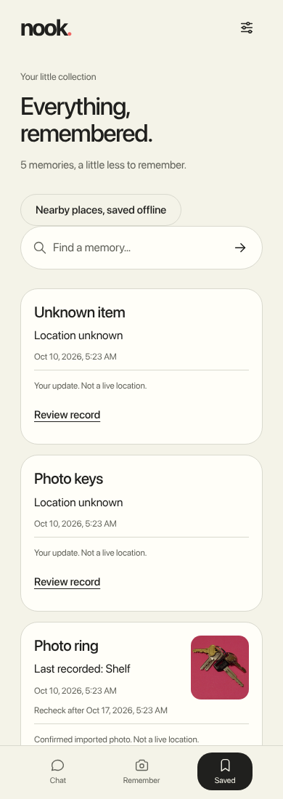
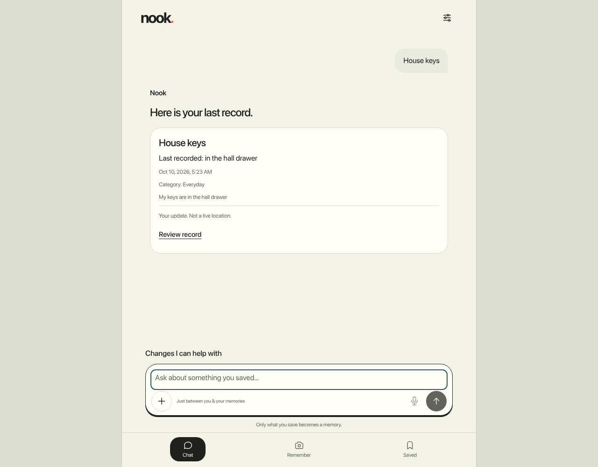
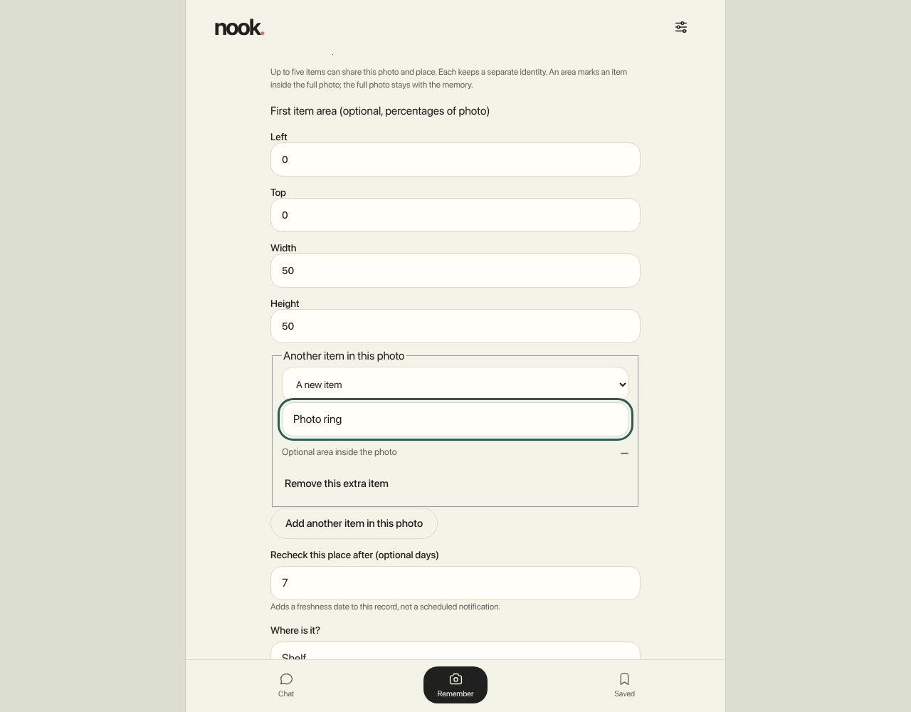

# Nook

Your everyday memory buddy. Save a reviewed memory and find its last-recorded place, time and photo.

[Quick start](#quick-start) · [Screenshots](#screenshots) · [Why local AI?](#why-does-this-product-benefit-from-running-ai-locally) · [Tests](#run-the-checks) · [Disclosures](#the-disclosures)

## The project

**Repository:** [marina21-cs/nook](https://github.com/marina21-cs/nook). **Registered team/members:** pending verification.

**Tested hardware:** AMD Ryzen 5 7535HS, 6 cores/12 threads, approximately 14.8 GiB usable RAM, Manjaro Linux x86_64 and CPython 3.11.15. Other operating systems and native-phone performance are not validated.

- **Remember:** preview a typed memory, then explicitly Send; review item names and places from photos.
- **Find:** ask typed questions, search aliases and see dated evidence.
- **Maintain:** preview and approve bounded record changes, review history, mark locations unknown or delete memories.
- **Keep it local:** retain confirmed memories across restarts and search a separately downloaded nearby-place cache.
- **Chat locally:** opt into Qwen2.5 0.5B for generated replies with temporary context, kept separate from confirmed memories.
- **Add voice:** optional local dictation and spoken replies with separately provisioned speech models.

### Quick start

For optional genuine generation, follow the [judge local-chat guide](docs/JUDGE_LOCAL_CHAT_SETUP.md). It distinguishes accepted existing-host behavior from untested clean-install steps; default typed mode below remains models off.

**Prerequisites:** Python **3.11** with `pip` and `venv`, Git, and a modern browser on the same computer. Typed mode needs **no model, account or API key**. Initial clone/install needs internet unless files are cached. The pinned dependencies include native packages (NumPy, OpenCV and Pillow); install compatibility depends on the OS and CPU.

| Your environment | Current setup status |
| --- | --- |
| Linux x86_64 — Bash/zsh | Reference setup below; tested on Manjaro and CPython 3.11.15. Other distributions are unverified. |
| macOS — Bash/zsh | Shell-compatible instructions; installation and runtime **unverified**. [macOS details](#macos--bashzsh-unverified). |
| Native Windows — PowerShell | **Blocked by the published storage code**, even with models off. [Windows details](#windows--powershell-blocked). |
| Windows with an existing WSL Linux environment | Possible Linux-based route, but WSL installation, filesystem behavior and browser integration are unverified. |
| Phones, tablets and other architectures | No validated native backend or inference setup. [Device limits](#phones-tablets-and-other-devices). |

#### Linux — Bash/zsh

These commands call the virtual environment's Python directly; shell activation is unnecessary. Keep all models disabled for the typed setup. The existing laptop environment passed the documented checks; a fresh-machine installation is still pending.

**1. Get the source**

```sh
git clone https://github.com/marina21-cs/nook.git
cd nook
```

**2. Install the pinned dependencies**

```sh
python3.11 -m venv .venv
.venv/bin/python -m pip install --require-hashes -r requirements.lock
.venv/bin/python -m pip check
```

**3. Start Nook with a separate demo store**

```sh
APP_DATA_DIR="$PWD/.expanded-demo-data" \
APP_PORT=8765 \
APP_VISION_DISABLED=1 \
APP_VOICE_ENABLED=0 \
APP_CHAT_ENABLED=0 \
APP_POI_DOWNLOAD_ENABLED=0 \
APP_TEXT_MODEL='' \
.venv/bin/python -m app
```

Open **[http://127.0.0.1:8765/](http://127.0.0.1:8765/)** on the same computer. Nook creates the demo store on first launch and reuses it on restart. **Stop:** press `Ctrl+C` in the server terminal. Keep `.expanded-demo-data` private.

**4. Try an invented memory**

1. Select **Get Started** and complete the three-step setup with an invented name.
2. In **Remember**, type **My keys are in the hall drawer**.
3. Inspect the parsed preview, then select **Send** to save it.
4. Open **Chat** and ask **where are my keys?**.
5. Try `move "My keys" to "desk"`, inspect the proposed change, then cancel or explicitly approve it.

Use a fresh demo directory: schema migration 004 is forward-only for older application versions. [Version and reproduction notes](docs/EXPANDED_RELEASE.md).

[More synthetic examples](examples/synthetic-memories.json) are supplied for manual entry; there is no seed/import command for this JSON. To try a photo, choose the included public fixture [`tests/fixtures/vision/keys.jpg`](tests/fixtures/vision/keys.jpg) and review its label/place yourself.

#### macOS — Bash/zsh (unverified)

The clone, virtual-environment and environment-variable syntax above also applies to Bash/zsh on macOS when `python3.11` is installed. This is an exploratory path, **not a validated macOS quick start**: pinned package availability, secure file-open flags, locking and directory synchronization still need a clean install and runtime check. Use a fresh demo directory and keep voice, vision and text models disabled. No macOS-specific fix is included in this version.

#### Windows — PowerShell (blocked)

Native Windows cannot currently start this backend. [`app/evidence_store.py`](app/evidence_store.py) imports the [Unix-only `fcntl` module](https://docs.python.org/3.11/library/fcntl.html) during startup and uses POSIX storage operations. Changing `.venv/bin/python` to a Windows path or translating environment variables to PowerShell does not resolve that blocker. A reviewed storage implementation and Windows acceptance are needed before a runnable PowerShell recipe can be provided. Successful package installation alone would not prove Windows support.

An existing WSL Linux environment may provide a future testing route; it has not been validated here and is not native Windows support. This guide does not install WSL or change system/network settings.

#### Phones, tablets and other devices

The server binds to **`127.0.0.1` only**. Open the browser on the computer running Nook; a phone's localhost points to the phone, not the laptop. Responsive screenshots demonstrate layout, not remote-device connectivity or native phone AI. LAN access, native mobile execution and other CPU architectures require separate implementation/acceptance.

**Optional AI is a separate platform boundary.** The current Whisper/Kokoro runtime paths and resource guards target Linux x86_64 and specific Linux sensors. There is no accepted voice setup for macOS, Windows, Apple Silicon, other ARM devices or phones. Typed mode does not require those models or laptop-specific model guards, but it still requires the application's storage operations. Model-enabled vision also remains a separate validation task.

<details>
<summary><strong>Optional models and browser-test tooling</strong></summary>

The quick start disables model inference and area downloads. For genuine generated chat, see the separately provisioned [optional local-chat setup](docs/LOCAL_CHAT_SETUP.md) and its exact model/runtime requirements. Optional voice has a [hash-pinned setup manifest](voice/setup-manifest.json) and [explicit setup instructions](voice/SETUP.md). Installer fixture tests passed; real fresh-machine installation and current-UI speech remain unverified. The empty-cache payload is 820,069,956 bytes plus transfer overhead and installation space. Models are never downloaded automatically. Linux sensor/resource guards restrict supported execution. Use the current setup manifest; historical provisioning receipts include a corrected partial-wheel error.

Browser integration tests need separately installed Node, Playwright and Chromium. Set `PLAYWRIGHT_MODULE` to the absolute path of the installed Playwright module, `CHROMIUM_EXECUTABLE` to the Chromium executable and `APP_TEST_PYTHON` to the checkout's `.venv/bin/python` before running `node scripts/nook_browser_test.cjs`. The script creates temporary synthetic records; it does not install those tools. Run it in a disposable checkout because it refreshes test evidence/screenshots.

</details>

### Why does this product benefit from running AI locally?

Household details and spoken questions can be personal. With the optional runtime provisioned, **Whisper** can transcribe speech and **Kokoro** can speak a reply on the laptop without sending that audio to a cloud AI provider. This enables offline speech processing after setup and avoids dependence on a per-request cloud AI service, subject to the testing limits below.

Confirmed memories and photos also stay local, but that benefit comes from **SQLite and application logic**, separate from AI. Typed saved-item recall uses structured evidence lookup. Separately enabled Qwen chat generates unverified replies with temporary context on the laptop; it cannot write saved memories or use external tools.

| Works locally after setup | Needs internet |
| --- | --- |
| Browser UI, loopback API, confirmed memories, photos and typed recall | Initial source/dependency/model acquisition |
| Optional speech with matching runtime and model files; lookup of cached nearby places | Explicit, consented area download; GitHub and video/social hosting |

The optional area downloader is disabled by default. Enabling it and confirming a download shares a manually entered bounding box and connection IP with the fixed OpenStreetMap Overpass provider. Cached lookup is local data access; it does not establish live location, complete coverage, routes, opening hours or stock. [Bounds, consent and attribution](docs/EXPANDED_RELEASE.md#optional-nearby-place-download).

## The proof

### Screenshots

<p align="center">
<a href="deliverables/nook-ui-alignment/saved-mobile.png"></a>
</p>

**Earlier expanded UI (`7c3ff877…`), with invented records.** Click an image for full size.

<details>
<summary><strong>Dated recall and bounded record changes — desktop</strong></summary>

<a href="deliverables/nook-ui-alignment/talk-desktop.png"></a>

</details>

<details>
<summary><strong>Review multiple item identities from one photo — desktop</strong></summary>

<a href="deliverables/nook-ui-alignment/capture-desktop.png"></a>

</details>

[Earlier expanded three-image gallery](deliverables/nook-ui-alignment/README.md) · [Hashes and inspection](docs/EXPANDED_SCREENSHOT_PROVENANCE.json) · [Historical baseline gallery](deliverables/nook-integration/README.md). Mobile captures are laptop browser viewports, not native-phone proof.

[Send repair screenshots and results](deliverables/nook-chat-repair/README.md) show the later bounded greeting and saved-memory recall. Both were inspected and use synthetic records.

| Submission material | Link or status |
| --- | --- |
| Public repository | [marina21-cs/nook](https://github.com/marina21-cs/nook) |
| Approximately one-minute demo | Pending separate final video publication; no video is included in this source update |
| X/LinkedIn video | Pending |
| Registered team and members | Pending verification |

### Testing and setup limits

**Accepted local-chat source:** [112-file inventory](docs/LOCAL_CHAT_SOURCE_MANIFEST.json), SHA256 `a193c89c0938529adba9d08aeb54f4ce0f316a7dd81be2e280775f4e1abc46cd`. 527 backend tests ran on identical app bytes; later provisioner-only changes passed 29 affected tests. 31 browser and 15 Send/timeout checks passed. The subsequent full 528-suite attempt was swap-aborted: no 528-pass claim. These suites overlap and must not be added together.

**Real local generation:** corrected monitored run e returned two actual CPU-generated replies in **5.452s and 4.370s** using Qwen2.5 0.5B Instruct Q4_K_M and Ollama 0.30.6. Shared context, grounded saved/unknown/pronoun lookup, reset, runtime-unavailable recovery and restart behavior passed. The follow-up retained the correct Mira/green-kite facts but repeated the first sentence: this is narrow contextual acceptance, not broad conversation quality. [Evidence and limits](docs/LOCAL_CHAT_VERIFICATION.json).

**Video correspondence:** final generated-chat browser footage and its complete playback/listening review remain pending. No video is included in this source update. The version-labeled screenshots above do not prove new generated chat; the separate HTTP acceptance receipt does.

Earlier [100-file expanded](docs/EXPANDED_VERIFICATION.json) and [103-file bounded Send](docs/SEND_REPAIR_VERIFICATION.json) results stay tied to their own source inventories. [Current reproduction/version notes](docs/CURRENT_RELEASE.md).

Real-vision tests were excluded. Fresh-machine installation, execution from this newly exported archive, real current-UI speech, human English/Taglish quality, general visual recognition and physical camera/microphone behavior remain unverified. Optional speech has earlier synthetic backend evidence; laptop-specific guards may block execution. The POI restart/offline check denied Python sockets, not all OS networking. Saved evidence does not prove an item's current location.

The [historical baseline](docs/BASELINE_VERIFICATION.json) retains its separate 335 backend / 54 browser / 335 extracted-source evidence and [original source commit](https://github.com/marina21-cs/nook/tree/fca8ae7d5ca22560550d000c9f01468d2b982052). Those counts are not current expanded-archive acceptance.

### Run the checks

From the repository root, after installing the locked dependencies:

```sh
.venv/bin/python -m pytest --ignore=tests/test_vision.py
.venv/bin/ruff check app tests scripts
.venv/bin/mypy app
```

With Node installed:

```sh
node scripts/frontend_audio_test.cjs
node --test tests/frontend/memory-prompt.test.mjs
```

The optional browser command is `node scripts/nook_browser_test.cjs`; provision its explicit tooling paths as described above. Software checks do not establish real model or device acceptance.

## The disclosures

**Runtime components**

| Component | Purpose | Configuration in this release |
| --- | --- | --- |
| Structured evidence lookup | Retrieve confirmed records, aliases, dates and photos from SQLite | Default typed flow; deterministic application logic, not a language model |
| [Qwen2.5 0.5B Instruct Q4_K_M](https://ollama.com/library/qwen2.5:0.5b-instruct-q4_K_M) | Optional genuine local generation with bounded RAM-only context; unverified output cannot write records | Off in the quick start; two real contextual HTTP replies accepted, generated UI capture pending |
| [Whisper tiny](https://huggingface.co/openai/whisper-tiny/tree/169d4a4341b33bc18d8881c4b69c2e104e1cc0af) | Local speech-to-text | Optional; off in the setup command |
| [Kokoro-82M / af_heart](https://huggingface.co/hexgrad/Kokoro-82M/tree/f3ff3571791e39611d31c381e3a41a3af07b4987) | Local text-to-speech | Optional; off in the setup command |
| [OpenCV Zoo NanoDet](https://huggingface.co/opencv/object_detection_nanodet/blob/81a2a35b00f92e9bd03f03d9b611076d9aa2f942/README.md) | Object-box/category suggestions when enabled with matching weights | Disabled in the setup command; poor target-item results, so user review remains essential |

Speech file URLs, pinned revisions, sizes and SHA256 hashes are in the [artifact manifest](voice/artifacts/manifest.json); NanoDet's hash and terms are in [model provenance](models/README.md). The optional Qwen chat [official registry manifest and layer hashes](models/qwen2.5-0.5b-instruct-q4_K_M/provenance.json), [exact manifest](models/qwen2.5-0.5b-instruct-q4_K_M/manifest.json) and [Apache-2.0 license](models/qwen2.5-0.5b-instruct-q4_K_M/LICENSE) are retained. The accepted chat runtime is [Ollama 0.30.6](https://github.com/ollama/ollama/releases/tag/v0.30.6), CPU-only with cloud disabled. No weights are published. Retained [voice/model notices](voice/licenses/), [Whisper model card](voice/artifacts/whisper/README.md), [NanoDet license](models/LICENSE) and [dependency provenance](V1_PROVENANCE.md) preserve their separate terms, including GPL/LGPL speech components.

**Earlier experiments:** SmolVLM-500M was not integrated; its CPU FP32 test timed out after 30 seconds at about 3.9 GiB peak worker RSS. Earlier Qwen/Gemma search-normalization experiments did not establish a retrieval improvement. They are distinct from the newly accepted optional Qwen chat transport. [Historical experiment details](docs/MODEL_EXPERIMENTS.md).

**Frameworks and technologies:** Python, FastAPI, Pydantic, Uvicorn, SQLite, HTML/CSS/JavaScript, Pillow, HTTPX, OpenCV and NumPy. Optional chat uses Ollama 0.30.6; optional speech uses CPU PyTorch, Transformers, Kokoro, Misaki and spaCy. Tests use pytest, Ruff, mypy and Playwright/Chromium. Exact versions and retained hashes: [base lock](requirements.lock), [current voice setup inputs](voice/setup-manifest.json), [historical speech inventory](voice/evidence/dependencies.json), [speech provenance](release/v1/voice-dependency-provenance.json).

**APIs and cloud services:** local FastAPI; official package/model sources for provisioning; optional explicitly consented OpenStreetMap Overpass area download at `https://overpass-api.de/api/interpreter`; GitHub for code hosting. Cached OSM data requires [OpenStreetMap attribution](https://www.openstreetmap.org/copyright) and [ODbL terms](https://opendatacommons.org/licenses/odbl/1-0/). No place dataset is shipped. ElevenLabs **Eleven Multilingual v2**, using **Chris O. — Natural, Warm, Conversational**, generated two postproduction narration takes. Narration is added in editing; it is not Nook's runtime speech or proof of a successful app response. Earlier video material was prepared separately. Final video publication, full motion playback, listening/caption-sync review, publication rights/attribution confirmation and hosted/social URLs remain pending; no video is included here. Nook's optional runtime speech uses local Whisper/Kokoro; no cloud runtime inference or deployment is claimed.

**Existing code and assets:** the NanoDet adapter uses Apache-2.0 OpenCV Zoo reference logic. Tabler icons retain their [MIT notice](docs/mobile-ui-reference/TABLER-LICENSE). The keys photo is Eviatar Bach / InverseHypercube's “Keys with pink background.JPG”, CC0 1.0; see [fixture attribution](tests/fixtures/vision/README.md). The included WAV is synthetic Kokoro speech. The UI uses system fonts and inline vectors; final rights/history confirmation for the Rello-inspired mascot and reference-based visual treatment remains pending. Reference captures are excluded. Existing Python/Ollama runtimes and earlier text-model experiments predate this implementation. The exact Qwen chat model was separately reacquired and hash-verified for the accepted run; its private cache is not distributed.

**AI development tools:** Codex assisted code, tests, design, documentation and publication preparation. Complete contributor, pre-hackathon code and additional AI-tool history still needs team confirmation; exact development-model versions and actual Devin use are not inferred from filenames or sponsor tags.

**Application license:** pending the owner's decision; no blanket code license has been selected. Third-party notices remain applicable. Team details, final media/social URLs and disclosure completeness remain open submission fields.
